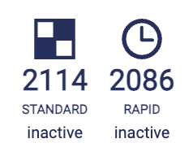
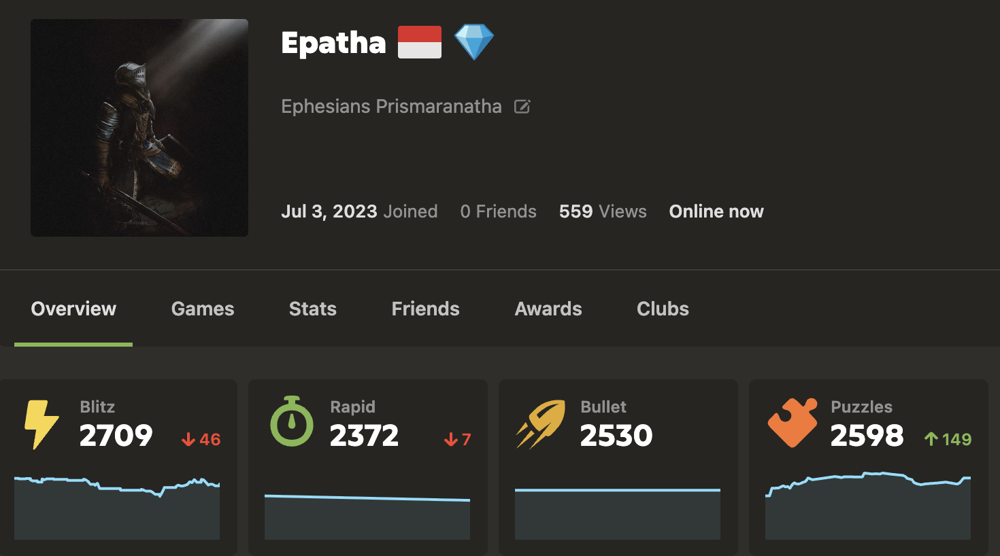
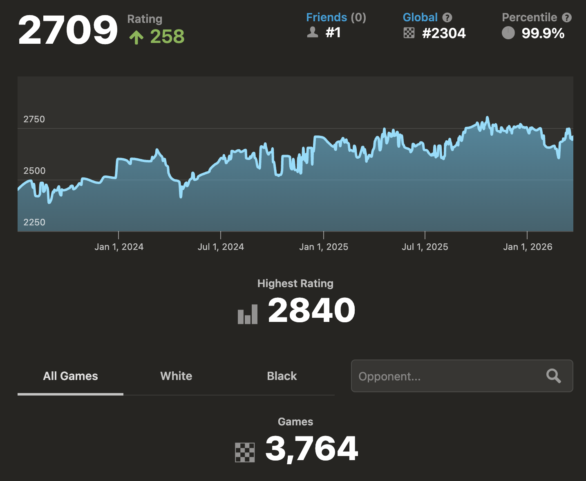
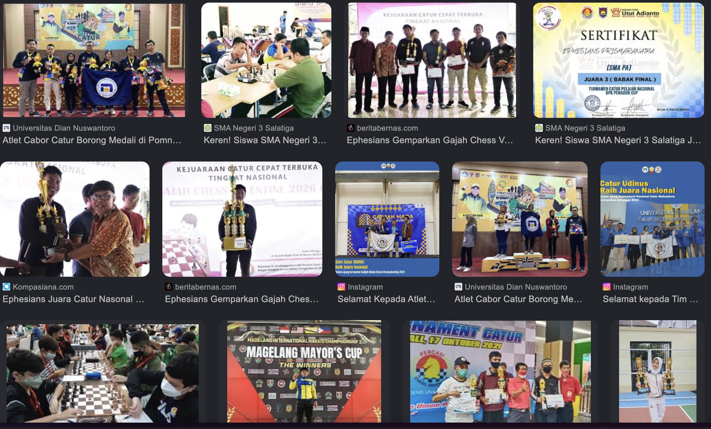

"🏆 45+ tournaments | Multiple 🥇 | ♟️ 2700+ rating online

Click →
Detailed page with table + links
## 🎖️ Tournament Achievements (2022-2026)

**Click any tournament name to view my detailed results on chess-results.com**

| # | Tournament Name | Level | Date | Result |
|---|---|---|---|---|
| 1 | [Turnamen Catur Non Master - Kluban Bothok Cup II](https://s3.chess-results.com/tnr1341926.aspx?lan=26&SNode=S0) | National | 30 Jan 2026 | 🥉 |
| 2 | [Turnamen Catur Grand Opening - Pucung Chess Club 1](https://s1.chess-results.com/tnr1332969.aspx?lan=1&art=0&turdet=YES&SNode=S0) | National | 18 Jan 2026 | 🥇 |
| 3 | [Nara Kupu Chess Competition (Umum)](https://s1.chess-results.com/tnr1333389.aspx?lan=11&SNode=S0) | National | 17 Jan 2026 | 🥉 |
| 4 | [Pondok Gajah Chess Valentine 2026 Cup Open](https://chess-results.com/tnr1352992.aspx?lan=26) | National | 15 Feb 2026 | 🥇 |
| 5 | [ITB Rapid Chess Series 2025 - Kategori Beregu](https://chess-results.com/tnr1168851.aspx?lan=1) | National | 10 May 2025 | 🥉 |
| 6 | [Turnamen Catur Beregu Piala Bergilir Ketua MPR RI](https://chess-results.com/tnr1163820.aspx?lan=1) | National | 18 May 2025 | 🥇 |
| 7 | [Turnamen Beregu Pasar Pagi Mangga Dua KGCC](https://chess-results.com/tnr1239504.aspx?lan=1) | National | 5 Jul 2025 | 🥈 |
| 8 | [Gebyar Catur Beregu Akhir Tahun DNC Brebes](https://chess-results.com/tnr1091244.aspx?lan=1) | National | 31-01 Des 2025 | 🥈 |
| 9 | [Perca Paras Cup III 2025](https://chess-results.com/tnr1186167.aspx?lan=1) | National | 25 May 2025 | 🥈 |
| 10 | [POMPROV Beregu Klasik Putra Jawa Tengah](https://chess-results.com/tnr1207117.aspx?lan=1) | Regional | 1-3 Jul 2025 | 🥇 |
| 11 | [POMPROV Beregu Cepat Putra Jawa Tengah](https://chess-results.com/tnr1207117.aspx?lan=1) | Regional | 1-3 Jul 2025 | 🥇 |
| 12 | [POMPROV Kilat Cepat Putra Jawa Tengah](https://chess-results.com/tnr1207117.aspx?lan=1) | Regional | 1-3 Jul 2025 | 🥇 |
| 13 | [POMPROV Mix Kilat Jawa Tengah](https://chess-results.com/tnr1207117.aspx?lan=1) | Regional | 1-3 Jul 2025 | 🥇 |
| 14 | [Turnamen Beregu Pasar Pagi Mangga Dua](https://chess-results.com/tnr1239504.aspx?lan=1) | National | 23 Aug 2025 | 🥈 |
| 15 | [Kompetisi Catur Cepat III Beregu Yogyakarta](https://chess-results.com/tnr1241342.aspx?lan=1) | National | 24 Aug 2025 | 🥇 |
| 16 | [Super Challenge Super Chess National Tournament 3](https://chess-results.com/tnr1196574.aspx?lan=26) | National | 19-20 Jul 2025 | 🥈 |
| 17 | [Dipo Chess Tournament 2025 (Open)](https://s2.chess-results.com/tnr1276041.aspx?lan=1&art=0&turdet=YES&SNode=S0) | National | 19 Oct 2025 | 🥇 |
| 18 | [POMNAS XIX - Standar Beregu Putra](https://chess-results.com/tnr1256543.aspx?lan=1) | National | 21-24 Sept 2025 | 🥈 |
| 19 | [POMNAS XIX - Cepat Beregu Putra](https://chess-results.com/tnr1256543.aspx?lan=1) | National | 21-24 Sept 2025 | 🥈 |
| 20 | [POMNAS XIX - Kilat Beregu Putra](https://chess-results.com/tnr1256543.aspx?lan=1) | National | 21-24 Sept 2025 | 🥉 |
| 21 | [Kejuaraan Catur Beregu Antar Club se-Kota Semarang](https://chess-results.com/tnr1262514.aspx?lan=26) | National | 28 Sept 2025 | 🥇 |
| 22 | [Petompon Chess Tournament 2025](https://s3.chess-results.com/tnr1311135.aspx?lan=5&art=1&rd=8&SNode=S0) | Regional | 7 Dec 2025 | 🥉 |
| 23 | [Kejuaraan Catur Terbuka PERCASI Kab. Temanggung](https://s3.chess-results.com/tnr1315829.aspx?lan=1&art=1&rd=8&turdet=YES&SNode=S0) | National | 14 Dec 2025 | 🥇 |
| 24 | [Rektor Cup III UIN Sunan Gunung Djati Bandung](https://s1.chess-results.com/tnr1321897.aspx?lan=1&art=1&rd=8&flag=30&SNode=S0) | National | 25 Dec 2025 | 🥇 |
| 25 | [Petra Chess Competition 2024 (Single Rapid)](https://s1.chess-results.com/tnr941090.aspx?lan=1&art=1&rd=7&SNode=S0) | National | 17 May 2024 | 🥉 |
| 26 | [UNNES Chess Championship 2024 (Beregu)](https://chess-results.com/tnr992488.aspx?lan=1) | National | 24 Aug 2024 | 🥉 |
| 27 | [Petra Chess Competition 2024 (Team Rapid)](https://chess-results.com/tnr941089.aspx?lan=1) | National | 17-18 May 2024 | 🥇 |
| 28 | [UNNES Chess Championship 2024 (Nasional)](https://chess-results.com/tnr993084.aspx?lan=1&art=1&rd=8) | National | 25 Aug 2024 | 🥉 |
| 29 | [Open Chess Tournament Ratna Group Salatiga Cup](https://s1.chess-results.com/tnr1035920.aspx?lan=1&art=1&rd=9&SNode=S0) | National | 20 Oct 2024 | 🥇 |
| 30 | [Turnamen Catur Beregu ICCA VII Piala Bang Imam](https://chess-results.com/tnr945715.aspx?lan=1) | National | 28 May 2024 | 🥇 |
| 31 | [Turnamen Catur Cepat Bupati Batang Cup 2024](https://s1.chess-results.com/tnr993883.aspx?lan=1&art=1&rd=9&SNode=S0) | National | 1 Sept 2024 | 🥇 |
| 32 | [Open Turnamen Catur M. Rajasa Danny A, SH Cup](https://s1.chess-results.com/tnr1096832.aspx?lan=7&art=1&rd=8&SNode=S0) | National | 12 Jan 2025 | 🥈 |
| 33 | [Turnamen Catur Terbuka Lindu Aji Cup 1 Pekalongan](https://chess-results.com/tnr951696.aspx?lan=1) | National | 23 Jun 2024 | 🥉 |
| 34 | [Turnamen Catur Yunior & Non Master PKB Genuk](https://chess-results.com/tnr1062544.aspx?lan=1) | Regional | 17 Nov 2024 | 🥇 |
| 35 | [PORPROV Jateng - Catur Cepat](https://s1.chess-results.com/tnr801979.aspx?lan=26&art=1&SNode=S0) | Regional | 5-11 Aug 2023 | 🥇 |
| 36 | [PORPROV Jateng - Catur Kilat](https://s3.chess-results.com/tnr802636.aspx?lan=26&art=1&SNode=S0) | Regional | 5-11 Aug 2023 | 🥉 |
| 37 | [POMNAS XVIII - Catur Beregu Klasik](https://s3.chess-results.com/tnr848552.aspx?lan=1&art=0&SNode=S0) | National | 12-22 Nov 2023 | 🥉 |
| 38 | [POMNAS XVIII - Papan Terbaik ke-2](https://s3.chess-results.com/tnr848552.aspx?lan=1&art=0&SNode=S0) | National | 12-22 Nov 2023 | 🥉 |
| 39 | [Gajah Mada Chess Championship 2023 (Beregu)](https://chess-results.com/tnr868049.aspx?lan=26) | National | 23 Dec 2023 | 🥇 |
| 40 | [Airlangga Chess Tournament 2023 (Beregu)](https://chess-results.com/tnr825930.aspx?lan=1) | National | 1 Oct 2023 | 🥇 |
| 41 | [Turnamen Catur Beregu ICCA VI](https://chess-results.com/tnr780091.aspx?lan=26) | National | 1 Aug 2023 | 🥉 |
| 42 | [Catur Nasional Beregu Universitas Airlangga](https://s1.chess-results.com/tnr679984.aspx?lan=1&art=0&flag=30&SNode=S0) | National | 16-17 Jul 2022 | 🥈 |
| 43 | [ITS Chess Tournament 2022 - Kategori Beregu](http://chess-results.com/tnr676374.aspx?lan=26) | National | 17-18 Sept 2022 | 🥈 |
| 44 | [Turnamen Catur Piala PCNU Jakarta Barat](https://s1.chess-results.com/tnr667218.aspx?lan=26&art=1&rd=8&SNode=S0) | National | 21 Aug 2022 | 🥇 |
| 45 | [Open Mandiraja Non Master 2022](https://s3.chess-results.com/tnr665218.aspx?lan=26&art=1&rd=7&SNode=S0) | National | 14 Aug 2022 | 🥉 |

---

## 🏆 Achievements & Credentials

### FIDE Rating

### Chess.com Profile

### Online Chess Performance

### Search Profile

---
